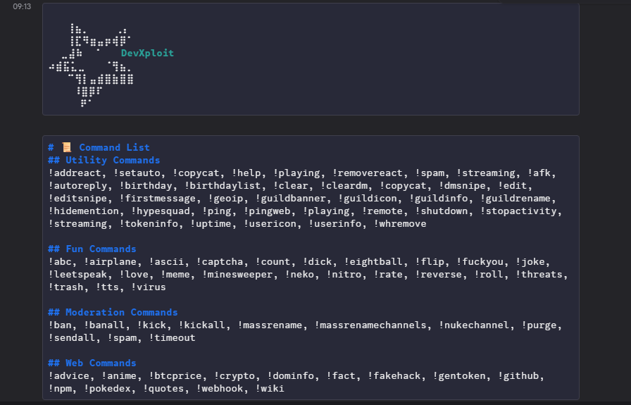

# 🚀 Rock-Selfbot-V4

[](https://github.com/your-username/Rock-Selfbot-V4)
[](LICENSE)
[](https://nodejs.org)
[](https://www.npmjs.com/package/discord.js-selfbot-v13)

Rock-Selfbot-V4 is a **Discord selfbot** built with [`discord.js-selfbot-v13`](https://www.npmjs.com/package/discord.js-selfbot-v13).  
It includes multiple **utility, fun, crypto, and custom message styling** commands to enhance your Discord experience.

> ⚠ **Disclaimer**:  
> Selfbots are against [Discord's Terms of Service](https://discord.com/terms). Using one may result in your account being banned.  
> I am **not responsible** for any harm, damages, or bans caused by the usage of this software.

---

## ✨ Features

- 📌 **Utility Commands** – Manage and customize your server easily.
- 🎭 **Fun Commands** – Keep the chat engaging and entertaining.
- 💹 **Crypto Prices** – Fetch real-time cryptocurrency data.
- 🎨 **Custom Message Styling** – Send beautiful, formatted messages.
- 💰 **Balance Checker** – Track user balances.
- ⚡ **Fast Setup** – Minimal configuration required.

---

## 📦 Installation & Setup

### 1️⃣ Clone the Repository
```bash
git clone https://github.com/obscurex404/Rock-Selfbot-V4.git
cd Rock-Selfbot-V4
```

### 2️⃣ Install Dependencies
```bash
npm install
```

### 3️⃣ Configure Your Bot
Edit `config.js` and set your **Discord token** and **command prefix**:
```js
module.exports = {
  token: "YOUR_DISCORD_TOKEN",
  prefix: "!"
 "allowed_users": [
        "user id"
}
```

### 4️⃣ Run the Bot
```bash
node index.js
```

---

## 📖 Command Showcase

| Category  | Command Example | Description |
|-----------|----------------|-------------|
| **Utility** | `!ping` | Check bot latency. |
| **Fun** | `!meme` | Sends a random meme. |
| **Crypto** | `!btc` | Shows current Bitcoin price. |
| **Style** | `!fancy Hello World` | Sends a styled message. |
| **Balance** | `!bal @user` | Shows mentioned user's balance. |

---

## 🔧 Requirements

- **Node.js** v16 or higher
- **npm** (comes with Node.js)
- A valid **Discord account** (selfbot use at your own risk)

---

## 🤝 Contributing

We welcome contributions!  
1. Fork the repository  
2. Create a new branch (`feature/my-feature`)  
3. Commit your changes  
4. Push to your branch  
5. Submit a Pull Request

---

## 📜 License

This project is licensed under the **MIT License** – see the [LICENSE](LICENSE) file for details.


### 👨‍💻 Created by: [devrock](https://github.com/devrock07)
💡 *Suggestions, issues, and feature requests are always welcome!*
